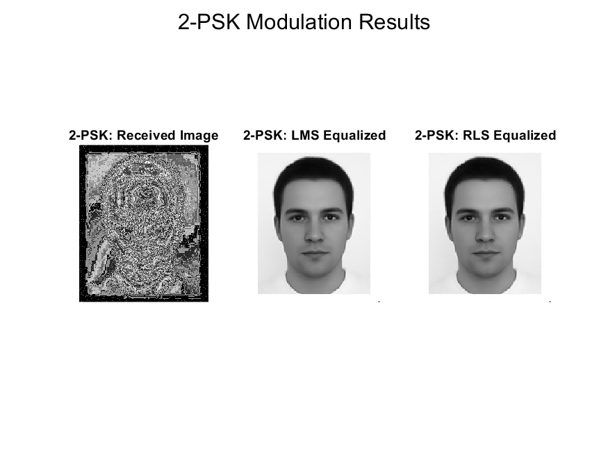
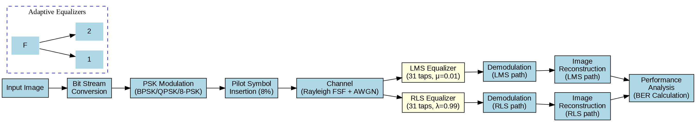

# Adaptive Equalization for Rayleigh Frequency Selective Fading Channels

This repository contains the implementation and analysis of Least Mean Squares (LMS) and Recursive Least Squares (RLS) adaptive equalization techniques for Rayleigh frequency selective fading channels. The work includes performance evaluation using BPSK, QPSK, and 8-PSK modulation schemes.

## Overview

Adaptive equalization is a critical technique for combating inter-symbol interference (ISI) in wireless communication systems. This project implements two popular adaptive equalization algorithms:
- **LMS (Least Mean Squares)**: Computationally efficient with good performance
- **RLS (Recursive Least Squares)**: Higher computational complexity but potentially faster convergence

The implementation demonstrates the effectiveness of these techniques through image transmission over simulated Rayleigh frequency selective fading channels.

## Features

- Implementation of LMS and RLS equalization algorithms
- Support for multiple PSK modulation schemes (BPSK, QPSK, 8-PSK)
- Image transmission simulation through fading channels
- Comprehensive BER (Bit Error Rate) analysis
- Visual comparison of received and equalized images
- Computational complexity analysis

## Results

Our implementation shows significant improvements in BER performance after equalization:

| Modulation | Algorithm | BER Before | BER After | Improvement |
|------------|-----------|------------|-----------|-------------|
| BPSK       | LMS       | 0.574252   | 0.000044  | 99.99%      |
| BPSK       | RLS       | 0.574252   | 0.000058  | 99.99%      |
| QPSK       | LMS       | 0.742420   | 0.001197  | 99.84%      |
| QPSK       | RLS       | 0.742420   | 0.001943  | 99.74%      |
| 8-PSK      | LMS       | 0.771211   | 0.236688  | 69.31%      |
| 8-PSK      | RLS       | 0.771211   | 0.228262  | 70.40%      |

### Visual Results


*BPSK modulation results: (left) received image before equalization, (middle) after LMS equalization, (right) after RLS equalization.*

## Getting Started

### Prerequisites

- MATLAB R2019b or later
- Image Processing Toolbox
- Communications Toolbox

### Installation

1. Clone the repository:
```
git clone https://github.com/username/adaptive-equalization-project.git
cd adaptive-equalization-project
```

2. Make sure you have a test image named `man.png` in the `data` directory or update the image path in the main script.

### Usage

Run the main script from MATLAB:

```
cd src
main
```

This will:
1. Load the test image
2. Process it through different modulation schemes
3. Apply channel effects
4. Perform LMS and RLS equalization
5. Calculate BER and display results

## System Implementation

The implementation follows this processing chain:



1. **Input Processing**: Convert grayscale image to bit stream
2. **Modulation**: Apply PSK modulation (BPSK, QPSK, or 8-PSK)
3. **Pilot Insertion**: Add 8% pilot symbols for equalizer training
4. **Channel Effects**: Apply Rayleigh FSF with 7 taps + AWGN at 15dB SNR
5. **Equalization**: LMS (step size=0.01) and RLS (forgetting factor=0.99)
6. **Demodulation**: Convert to symbols and bits
7. **Image Reconstruction**: Convert bits back to image
8. **Performance Analysis**: Calculate BER and visual quality

## Future Work

Future research directions include:
- Parameter optimization across different channel conditions
- Efficient software implementation of RLS to reduce computational requirements
- Testing with real-world channel measurements from various environments
- Simple hybrid approach that switches between LMS and RLS based on channel conditions


## References
Here's the list of references that contributed to this project:

1. Proakis, J. G. & Salehi, M. (2007). Digital Communications (5th ed.). New York: McGraw-Hill.

2. Haykin, S. (2013). Adaptive Filter Theory (5th ed.). Upper Saddle River, NJ: Prentice Hall.

3. Qureshi, S. U. H. (1985). Adaptive equalization. Proceedings of the IEEE, 73(9), 1349-1387.

4. Godard, D. N. (1980). Self-recovering equalization and carrier tracking in two-dimensional data communication systems. IEEE Transactions on Communications, 28(11), 1867-1875.

5. Widrow, B. & Hoff, M. E. (1960). Adaptive switching circuits. IRE WESCON Convention Record, part 4, 96-104.

6. Khajababu, Md., Padma Sree, Y., & Sridhar, G. V. (2015). Channel Equalization of Adaptive Filters Using LMS and RLS Algorithms. International Journal of Advanced Technology in Engineering and Science, 3(1), 71. ISSN (online): 2348-7550.

If you use this implementation in your research, please cite our work and these references that provided the theoretical foundation for this implementation.

## License

This project is licensed under the MIT License - see the LICENSE file for details.
